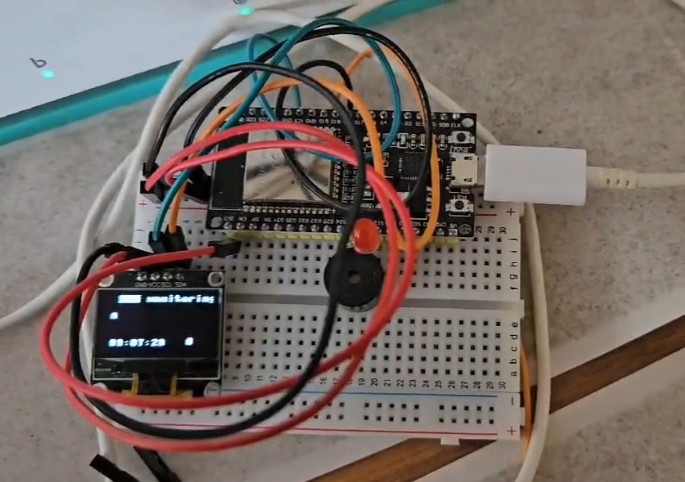

# ESP32 Alert System

## Project Overview

This project utilizes an ESP32 with MicroPython to create a sophisticated alert system that connects to the Home Front Command's alert service. It offers real-time notifications for selected areas and is designed to be faster than the official application. The system uses multithreading to handle multiple tasks simultaneously, features an LED display for visual notifications, and integrates with web APIs for up-to-date alert data. This makes it an ideal project to involve children in understanding technology and real-time event responsiveness.

[See demo](https://www.linkedin.com/posts/omer-reuveni_%D7%9E%D7%97%D7%A4%D7%A9%D7%99%D7%9D-%D7%A4%D7%A2%D7%99%D7%9C%D7%95%D7%AA-%D7%9E%D7%A9%D7%95%D7%AA%D7%A4%D7%AA-%D7%A2%D7%9D-%D7%94%D7%99%D7%9C%D7%93%D7%99%D7%9D-%D7%91%D7%94%D7%A9%D7%A8%D7%90%D7%AA-%D7%90%D7%99%D7%A8%D7%95%D7%A2%D7%99%D7%9D-activity-7185168339424473090-pU3K?utm_source=share&utm_medium=member_desktop)


## Features

- **Real-Time Alerts**: Immediate updates that outpace the official apps.
- **Multithreading**: Efficient handling of concurrent processes for seamless performance.
- **LED Display**: Visual alerts and status updates provided through an integrated LED display.
- **Web API Integration**: Fetches latest alert data from official web services.
- **Custom Area Selection**: Users can configure alerts for specific geographic locations.
- **Interactive Feedback**: Engages users with auditory (beeps) and visual (LED) alerts.
- **Educational Tool**: Excellent project for teaching children about technology and safety.

## Getting Started

Follow these instructions to set up the project on your local machine for development and testing.

### Prerequisites

Install MicroPython on your ESP32 device:

```bash
pip install esptool
esptool.py --port /dev/ttyUSB0 erase_flash
esptool.py --port /dev/ttyUSB0 --baud 460800 write_flash --flash_size=detect 0 esp32-20190125-v1.10.bin
